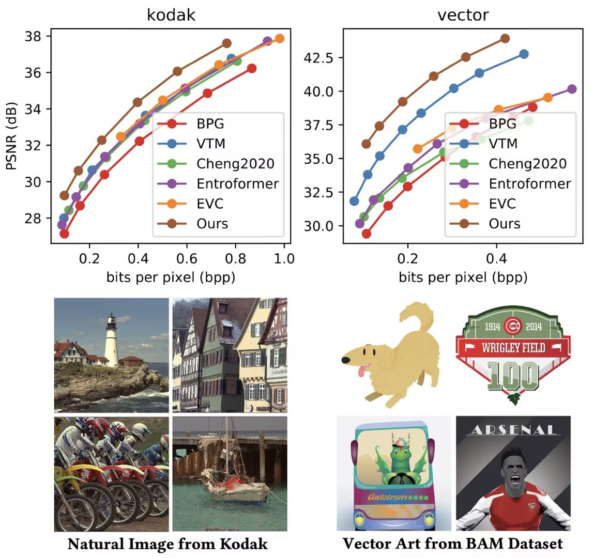
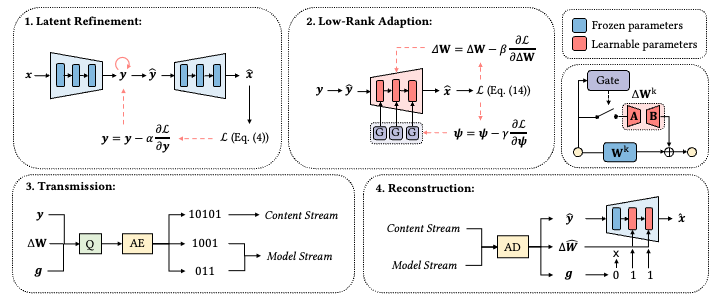
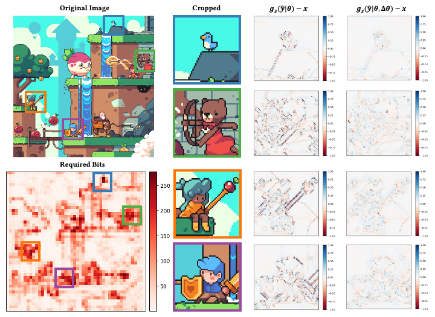
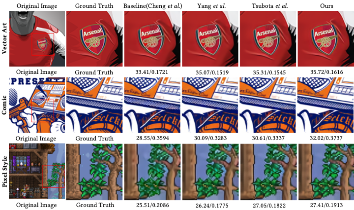

<div align="center">
<h1> Dynamic Low-Rank Instance Adaptation for Universal Neural
Image Compression
</center> <br> <center> </h1>

<p align="center">
<a href="https://arxiv.org/abs/xxxx.xxxxx" target="_blank">arXiv</a>

</div>

## Background
The latest advancements in neural image compression show great potential in surpassing the rate-distortion performance of conventional standard codecs. Nevertheless, there exists an indelible domain gap between the datasets utilized for training (i.e., natural images) and those utilized for inference (e.g., artistic images).

<p align="center">
    
    <br>
    <span><b>Figure 1. (upper left) Three state-of-the-art neural image codecs perform fairly well on the Kodak dataset. (upper right) But their performance drops significantly on an out-of-domain dataset containing artistic images. </b></span>
</p>

## Method
Our proposal involves a low-rank adaptation approach aimed at addressing the rate-distortion drop observed in out-of-domain datasets. Specifically, we perform low-rank matrix decomposition to update certain adaptation parameters of the client's decoder. These updated parameters, along with image latents, are encoded into a bitstream and transmitted to the decoder in practical scenarios. Due to the low-rank constraint imposed on the adaptation parameters, the resulting bit rate overhead is small. Furthermore, the bit rate allocation of low-rank adaptation is *non-trivial*, considering the diverse inputs require varying adaptation bitstreams. We thus introduce a dynamic gating network on top of the low-rank adaptation method, in order to decide  which decoder layer should employ adaptation. The dynamic adaptation network is optimized end-to-end using rate-distortion loss.

<p align="center">
     <br>
    <span><b>Figure 2. Simplified pipeline of our dynamic instance adaptive method.</b></span>
</p>

## Visualization


<p align="center"> 
      <br>
    <span><b>Figure 3. Visualization of reconstruction error with and without extra parameters using a pixel-style image as an example.</b></span>
</p>

<p align="center">
     <br>
    <span><b>Figure 4. Comparisons with other instance adaptive codecs on out-of-domain images.</b></span>
</p>


## Requirements

```
pip install compressai
pip install timm==0.6.7 dataclasses==0.8
```

## Dataset

Our self-collected 100 pixel-style gaming images are available at [google drive](https://drive.google.com/drive/folders/1iwKGoVAuQ6Q0rRIAygWmIS0feLs3OTNn?usp=sharing).

## Quick Start

```
sh eval.sh
```

or custom the config

```
CUDA_VISIBLE_DEVICES=0 python3 eval.py \
        --lambda {Bit-rate distortion parameter} \ 
        --quality {reconstruction quality, range [1, 6]} \
        -m cheng2020-attn \
        --epochs {optimize iteration, default 2000} \
        -lr {learning rate of low-rank decompose parameters, default 1e-3} \
        --cuda \
        --model_prefix {path to save the model update} \
        --image {path to input image}

```

